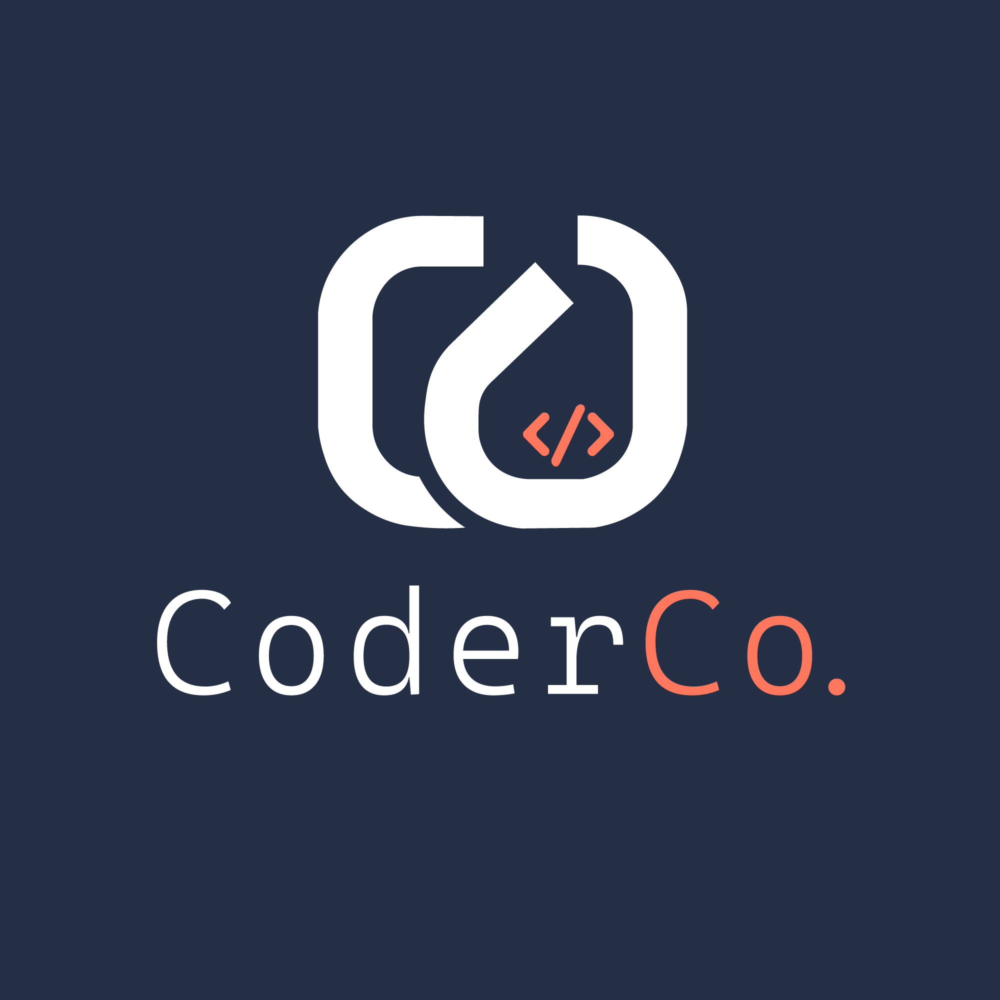

    

## BYO App/Service on AWS ECS or Lambda— You decide!

You’ll design and build a small app or service—anything you like—then deploy it to AWS using Terraform. The only non-negotiable requirements are below. Everything else is up to you.

## Requirements 📝

- Create Your Own App/Service
  - Must have at least one route or endpoint serving dynamic data (e.g., JSON, HTML, or specialized output).
  - You decide the tech stack, the language, the framework, etc.
  - Provide minimal instructions in your README for local setup.

- Deployment Target: ECS or Lambda
  - You must containerize your app if you choose ECS (push to ECR or DockerHub, your call).
  - If you choose Lambda, package the function for deployment. You must still store code in some repository.
  - Must run behind HTTPS (i.e., must have a domain, certificate and secure endpoint).

- Terraform, All the Way
  - All AWS resources should be created via Terraform, including domain DNS, cert, ECS/LB or API Gateway, etc.
  - Use DRY principle (create your own, don’t just stick everything in main.tf).
  - Show you know “proper” Terraform structure and best practices.

- CI/CD Pipeline
  - Must have an automated pipeline that builds, tests (some minimal test to prove it’s working), and deploys.
  - Keep credentials/secrets out of code. Use parameter store/secrets manager, vault or your own approach.
- Provide a link or explanation for your pipeline in your README.

- Architecture Diagram
  - Show us how your pieces fit together. Use any tool (Lucidchart, draw.io, mermaid, ASCII art, etc.).
  - Put it in your README.

- Project Deliverables
  - Repo with all code (app code + Terraform + pipeline files).
  - Running Service accessible at `https://<app>.<your-domain>` or `https://<whatever>.labs.<your-domain>`
  - README with a) instructions b) screenshots of the running service c) architecture diagram.

- Constraints & Hints (No Spoonfeeding)
  - Security: Keep secrets safe. Use IAM roles, not static keys in code.
  - Terraform: Using random providers or modules from the registry is allowed, but you have to figure out how to integrate them.
  - Domain/HTTPS: No plain HTTP. Show you can set up domain validation, route traffic properly, etc.
  - Advanced: If you want to stand out, consider canary deployments, multi-stage env, or custom logging/monitoring solutions.

Goal: Challenge yourself. This is intentionally open-ended so you can’t just copy/paste from GPT or tutorials. Demonstrate creativity, best practices and mastery of Infrastructure & DevOps.
